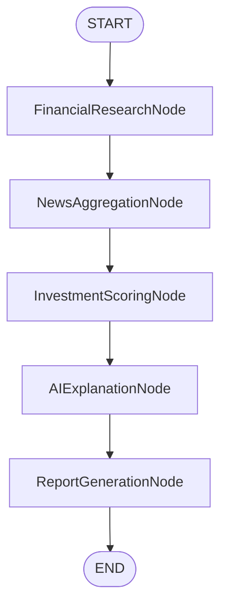

# InvestiMind AI – Intelligent Investment Research Powered by Explainable AI

InvestiMind AI is a production-grade, highly explainable, transparent, and auditable AI-driven investment research platform. It accepts a stock ticker or company name, aggregates financial metrics and media headlines, and computes a 100% deterministic score. A single Gemini 2.5 Flash API call is used purely to synthesize human-readable explainable narratives.

---

## 1. Core Feature Highlights
- **Deterministic scoring core**: AI has **0% influence** on scores, recommendations, risk limits, or reliability values.
- **Explainability Center**: High-impact checklists ("Why Not Higher?" and "Why Not Lower?") explain score drags and support levels based on dynamic sector targets.
- **Double-Score Assessment**: Mutually isolated indices for Data Confidence (source completeness and freshness) and Recommendation Reliability (mathematical validity).
- **Missing Data Impact Center**: Logs specific point penalties (-25 for financials, -12 for news) and lists affected components if any databases fail or keys are absent.
- **Provider & AI Transparency Panel**: Displays latency timelines, fallback statuses, and explicitly states where AI was used (narratives) vs. where it was strictly restricted (math/decisions).
- **Multi-Page A4 PDF Exporter**: Captured page-by-page from DOM elements to generate a clean 5-page PDF report.

---

## 2. System Workflow (LangGraph)



---

## 3. Project Directory Structure

```
src/
  app/
    api/
      research/
        route.ts
    layout.tsx
    page.tsx
  components/
    DashboardView.tsx
    InvestmentSummaryCard.tsx
    ExecutiveSummary.tsx
    ExplainabilityCenter.tsx
    InvestmentHealthReport.tsx
    ScoreContributionView.tsx
    MissingDataImpactCenter.tsx
    ConfidenceBreakdownView.tsx
    DataFreshnessCenter.tsx
    TransparencyPanel.tsx
    ProviderHealthCenter.tsx
    Charts/
      GaugeChart.tsx
      ScoreBarChart.tsx
      SentimentPieChart.tsx
      RadarComparisonChart.tsx
  agents/
    investmentResearchGraph.ts
  tools/
    yahooFinanceTool.ts
    newsFetcherTool.ts
  services/
    cache/
      cacheProvider.ts
      memoryCacheProvider.ts
    fetchCompanyFinancials.ts
    fetchCompanyNews.ts
    calculateInvestmentScore.ts
    generateInvestmentAnalysis.ts
  config/
    scoringRules.ts
    industryBenchmarks.ts
  types/
    research.ts
  lib/
    pdfExporter.ts
    tailwindMergeUtility.ts
  hooks/
    useTheme.ts
  docs/
    ARCHITECTURE.md
    API.md
    DECISION_ENGINE.md
    SCORING_METHODOLOGY.md
    SETUP.md
    DEPLOYMENT.md
    CONTRIBUTING.md
    FUTURE_ROADMAP.md
    AI_DEVELOPMENT_LOG.md
    PROJECT_GENERATION_PROMPT.md
```

---

## 4. Setup & Installation

### Environment Configurations
Create a `.env` file in the root directory:
```env
GEMINI_API_KEY=your_gemini_api_key
GNEWS_API_KEY=your_gnews_key
NEWS_API_KEY=your_newsapi_key
APIFY_API_TOKEN=your_apify_token
NEXT_PUBLIC_APP_NAME=InvestiMind AI
```

### Installation
```bash
npm install
```

### Run Web Development Server
```bash
npm run dev
```
Open [http://localhost:3000](http://localhost:3000) in your browser.

### Run Local CLI Runner
```bash
# Windows Powershell:
$env:TS_NODE_COMPILER_OPTIONS='{"module":"commonjs","target":"es2020"}'; npx ts-node src/scripts/testWorkflow.ts MSFT

# Linux / macOS:
TS_NODE_COMPILER_OPTIONS='{"module":"commonjs","target":"es2020"}' npx ts-node src/scripts/testWorkflow.ts MSFT
```
---

## 5. Architectural Trade-offs & Rationale
1. **In-Memory Caching vs. Redis**: We opted for memory caching (`memoryCacheProvider.ts`) to avoid database dependencies. This simplifies setup and keeps Vercel deployments serverless, but caches are local to the container instance. Caching contract provider interfaces are in place to plug in Redis if scaled.
2. **Sequential News Fetching vs. Concurrent Requests**: Fetching news sequentially allows GNews fallback checks (GNews -> NewsAPI -> Apify Twitter Scraper) to stop immediately when a provider succeeds, conserving API token quotes. A strict 5-second to 9-second timeout on each fetch ensures slow APIs do not block serverless execution.
3. **HTML Canvas capture vs. PDF Raw Layouts**: Raw PDF generation libraries (like `@react-pdf/renderer`) require recreating CSS layouts. We chose `html2canvas` + `jspdf` to convert the rendered dashboard, preserving charts, styles, and alignments in a high-fidelity 5-page PDF format.

---

## 6. Guides & Manuals

### Local Setup
For step-by-step instructions on setting up environment variables, running the local development server, linting, type checking, and running tests:
* Refer to the [Local Development Guide](file:///c:/Users/01may/OneDrive/Desktop/ai-agent/docs/LOCAL_DEVELOPMENT_GUIDE.md).

### Deployment
For detailed steps on uploading your project to GitHub, deploying serverless instances on Vercel, and configuring environment credentials:
* Refer to the [Vercel Deployment Guide](file:///c:/Users/01may/OneDrive/Desktop/ai-agent/docs/VERCEL_DEPLOYMENT_GUIDE.md).

### Submission Checklist
For the final audit check before sharing the code or submitting the assignment:
* Refer to the [Submission Checklist](file:///c:/Users/01may/OneDrive/Desktop/ai-agent/docs/SUBMISSION_CHECKLIST.md).
