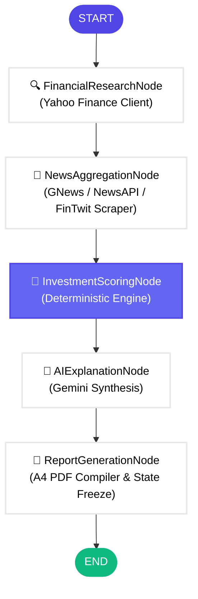

# 🛡️ InvestiMind AI
### *Explainable Investment Research Agent Powered by LangGraph & Gemini*

[](https://github.com/01mayankk/InvestiMind)
[](https://nextjs.org/)
[](https://github.com/langchain-ai/langgraphjs)
[](https://opensource.org/licenses/MIT)

InvestiMind AI is a premium, production-grade investment research platform designed to automate financial analysis with absolute mathematical transparency. The engine guarantees that generative AI has **0% influence** over scores, recommendations, risk limits, or reliability values. LLMs are used exclusively to synthesize explainable qualitative summaries based on deterministic scoring outputs.

---

## 🗺️ System Architecture & Workflow

The research process is orchestrated as a directed acyclic graph (DAG) via **LangGraph**, routing queries through sequential nodes to fetch data, compute metrics, and generate narrative explanations.



---

## 🚀 Key Feature Showcase

| Feature Component | Functionality & Rationale | Business Value |
| :--- | :--- | :--- |
| **🔢 Deterministic Math Core** | Scores are computed using hardcoded sector target benchmarks (P/E targets, Net Margins, Debt-to-Equity thresholds). | Guarantees auditability and removes AI hallucination risks. |
| **💡 Explainability Center** | Displays exact positive support drivers and score drags (`Why Not Higher?` / `Why Not Lower?`). | Allows analysts to understand recommendation reasons in seconds. |
| **🛡️ Double-Score Assessment** | Isolates **Data Confidence** (coverage, freshness) from **Recommendation Reliability** (mathematical completeness). | Identifies thin-data situations and degraded environments. |
| **📊 Dynamic Sector Benchmarks** | Evaluates metrics relative to specific sectors (e.g., Tech P/E target of 22x vs. Energy target of 12x). | Context-aware comparisons preventing false positives/negatives. |
| **⚡ Multi-Channel Fallbacks** | Cascades from GNews to NewsAPI, then down to live Twitter scrapers via Apify. | Bulletproof resilience against API request limits or network blocks. |
| **📄 Professional PDF Compiler** | Compiles state-frozen sections into high-fidelity multi-page A4 PDF documents. | Instantly shareable research reports for investment committees. |

---

## 🎨 Visual Preview & Screenshots

Here is the fully refactored, high-contrast, premium interface of InvestiMind AI:

### 1. Master Research Dashboard


### 2. Investment Health Sliders & Data Transparency


### 3. Score Contribution Details


### 4. Advanced Audit Log & System Trace (Collapsible)


---

## 📦 Project Directory Structure

```
src/
├── app/                      # Web Client Routing & Server API Endpoints
│   ├── api/
│   │   └── research/
│   │       └── route.ts      # Orchestrates LangGraph execution and outputs reports
│   ├── layout.tsx            # Global HTML template containing theme injectors
│   └── page.tsx              # Autocomplete search dashboard & theme switch controller
├── components/               # High-contrast, theme-reactive user interfaces
│   ├── Charts/               # Chart components (Gauges, Pie, and Comparison bars)
│   │   ├── GaugeChart.tsx
│   │   ├── RadarComparisonChart.tsx
│   │   └── SentimentPieChart.tsx
│   ├── DashboardView.tsx     # Master Layout orchestrating visual research panels
│   ├── InvestmentSummaryCard.tsx # Hero badge showing recommendation, strength & scores
│   ├── ExecutiveSummary.tsx      # Highlights AI narrative text & bull/bear bullet cards
│   ├── ExplainabilityCenter.tsx  # Checks support limits and metrics drag lists
│   ├── InvestmentHealthReport.tsx # Sliders displaying fundamentals vs industry averages
│   ├── NewsHighlights.tsx        # High-contrast sentiment-grouped headlines
│   ├── MissingDataImpactCenter.tsx # Warning notification mapping missing metrics points
│   ├── TransparencyPanel.tsx     # Charts representing exact AI contribution limits
│   └── SkeletonDashboard.tsx     # Shimmer-loader mirroring the layout during active analysis
├── agents/                   # Orchestration workflow
│   └── investmentResearchGraph.ts # Defines node states, bindings, and transitions
├── services/                 # core scoring and retrieval services
│   ├── calculateInvestmentScore.ts # Standardized mathematical scoring algorithms
│   ├── generateInvestmentAnalysis.ts # Contextual prompt compiler for Gemini API
│   ├── fetchCompanyFinancials.ts  # Fetches quarterly balances from Yahoo Finance
│   └── fetchCompanyNews.ts        # Coordinates multi-channel news aggregator flows
├── tools/                    # API Clients
│   ├── yahooFinanceTool.ts        # Client query client wrapper for stock metrics
│   └── newsFetcherTool.ts         # Handles NewsAPI, GNews, and Apify Twitter aggregations
├── config/                   # Target limits
│   ├── industryBenchmarks.ts      # Margin, debt-to-equity, and P/E sector baselines
│   └── scoringRules.ts            # Scoring maps and decision threshold bounds
├── types/                    # Domain Schemas
│   └── research.ts                # Zod schemas & TypeScript type interfaces
└── lib/                      # Base helper packages
    ├── pdfExporter.ts             # Captures DOM canvases for high-fidelity A4 printing
    └── tailwindMergeUtility.ts    # Class merger utilities
```

<details>
<summary><b>📂 Folder Responsibilities Breakdown</b></summary>

* **`src/app`**: Web router & API handlers. Core responsibility is handling web layouts and serving API requests.
* **`src/components`**: Theme-aware rendering blocks. Custom-tailored to offer clean visual feedback for light and dark environments.
* **`src/agents`**: Sequential graph mapping. Controls execution states and guarantees complete fallback coverage.
* **`src/services`**: Calculation and retrieval core. Contains the business logic for scoring formulas and prompt compilation.
* **`src/tools`**: Low-level network connectors. Communicates with financial APIs and social media scraper actors.
* **`src/config`**: Benchmark configurations. Controls the numerical limits of the scoring formulas.
* **`src/types`**: Type validations. Ensures strong static safety throughout the system.
</details>

---

## 🛠️ Technology Stack & Dependencies

| Category | Technology | Purpose |
| :--- | :--- | :--- |
| **Core Client** | Next.js 14 (App Router) | High-performance React framework for layouts & API endpoints. |
| **State Router** | `@langchain/langgraph` | Directs node routes, fallback chains, and compilation logic. |
| **LLM Core** | Gemini 2.5 Flash | Provides rapid, explainable qualitative investment summaries. |
| **Financial API** | `yahoo-finance2` | Fetches historical balances and sector data. |
| **Styling** | Tailwind CSS & Vanilla CSS | Enables premium typography (Outfit & Inter) and soft-light colors. |
| **Data Validation** | `zod` | Enforces type safety at boundary APIs. |

---

## 🏁 Quick Start & Local Setup

### 1. Environment Configurations
Create a `.env` file in the root folder of the project:
```env
GEMINI_API_KEY=your_gemini_api_key
GNEWS_API_KEY=your_gnews_api_key
NEWS_API_KEY=your_news_api_key
APIFY_API_TOKEN=your_apify_api_token
NEXT_PUBLIC_APP_NAME="InvestiMind AI"
```

### 2. Install Dependencies
```bash
npm install
```

### 3. Run Development Server
```bash
npm run dev
```
Open [http://localhost:3000](http://localhost:3000) to view the application.

### 4. Run CLI Runner (Terminal)
Evaluate a stock research node workflow directly from your command line:
```bash
# Windows PowerShell
$env:TS_NODE_COMPILER_OPTIONS='{"module":"commonjs","target":"es2020"}'; npx ts-node src/scripts/testWorkflow.ts NVDA

# macOS / Linux
TS_NODE_COMPILER_OPTIONS='{"module":"commonjs","target":"es2020"}' npx ts-node src/scripts/testWorkflow.ts NVDA
```

---

## 📘 Detailed Documentation Guides

To review further components of the codebase:
- 📖 [Local Development Guide](file:///c:/Users/01may/OneDrive/Desktop/ai-agent/docs/LOCAL_DEVELOPMENT_GUIDE.md) - Details setup commands, testing suites, and lint configurations.
- 📖 [Vercel Deployment Guide](file:///c:/Users/01may/OneDrive/Desktop/ai-agent/docs/VERCEL_DEPLOYMENT_GUIDE.md) - Guides you on importing codebases to Vercel and handling API env values.
- 📖 [Submission Checklist](file:///c:/Users/01may/OneDrive/Desktop/ai-agent/docs/SUBMISSION_CHECKLIST.md) - Contains the final compliance verification checklists.

---

## 🔮 Future Roadmap
- [ ] **Real-time SEC Filings Parsing**: Expand research agents to parse Form 10-K and 10-Q documents directly using text extraction nodes.
- [ ] **Multi-Stock Comparison Models**: Generate side-by-side benchmarking radars comparing up to 4 symbols in the same sector.
- [ ] **Scheduled Automated Portfolio Reviews**: Allow users to configure cron triggers running portfolio score updates every week, delivering results to Slack or email.
