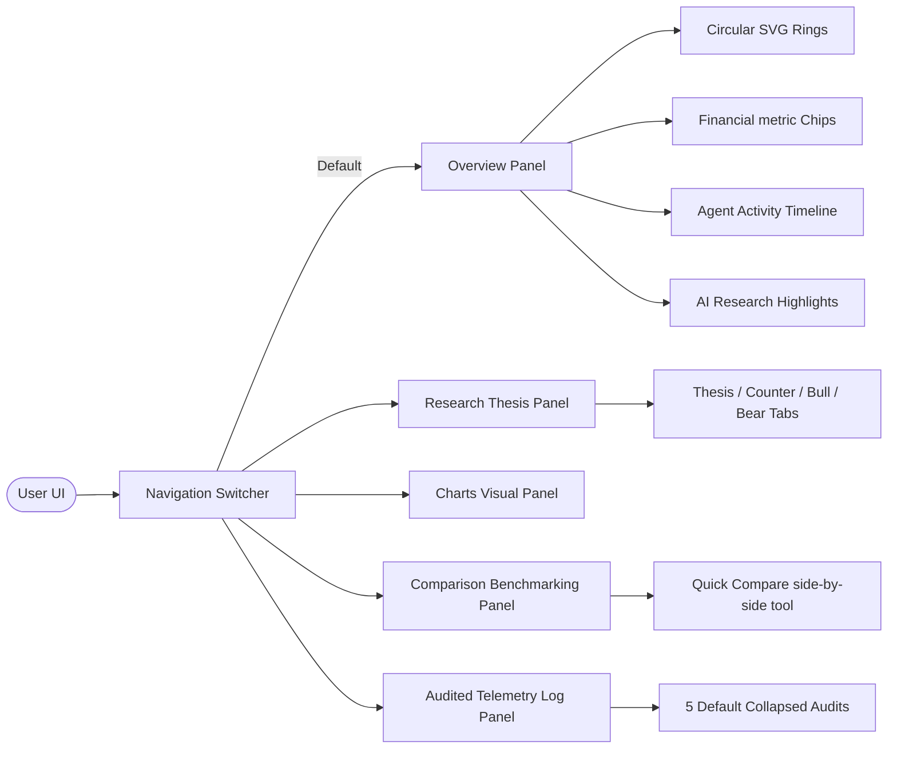
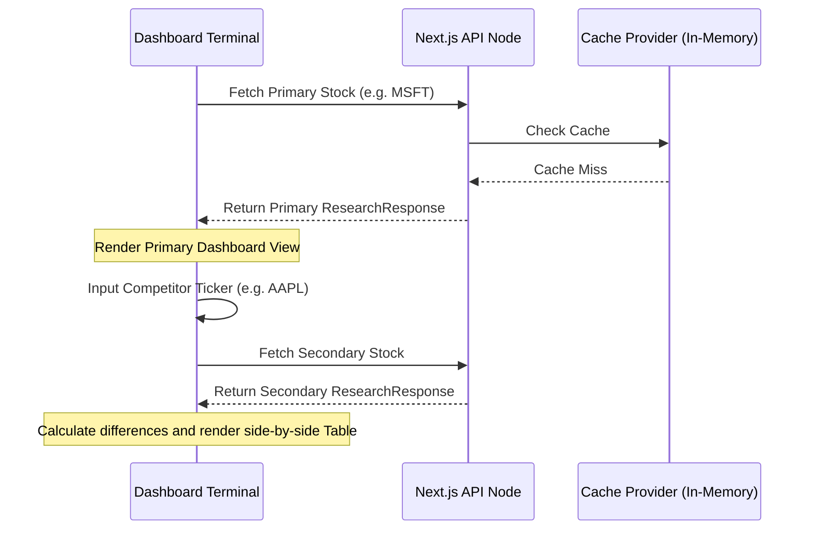

# System Architecture - InvestiMind AI Terminal

InvestiMind AI is designed with a strict clean architecture separating deterministic scoring logic (100% auditable TypeScript) from qualitative text analysis (100% LLM generated narrative). The V2.1 workspace terminal introduces tab-isolated dynamic displays to reduce scrolling and provide professional side-by-side benchmarking.

---

## 1. High Level Component Architecture

```
   ┌─────────────────────────────────────────────────────────┐
   │                  V2.1 TERMINAL INTERFACE                │
   │      (Left Sidebar / Command Palette / Mobile Bottom Nav)│
   └────────────────────▲───────────────────┬────────────────┘
                        │                   │
               Response │                   │ POST Request
                Payload │                   │ { query: string }
                        │                   ▼
   ┌────────────────────┴────────────────────────────────────┐
   │                   NEXT.JS API ROUTE                     │
   │               (src/app/api/research/route.ts)           │
   └────────────────────▲───────────────────┬────────────────┘
                        │                   │
                        │ Invoke            │ State Graph
                        │                   ▼ Output
   ┌────────────────────┴────────────────────────────────────┐
   │                  LANGGRAPH STATE AGENT                  │
   │        (src/agents/investmentResearchGraph.ts)          │
   └────────────────────▲───────────────────┬────────────────┘
                        │                   │
                Get info│                   │ Invoke
                        │                   ▼
   ┌────────────────────┴────────────────────────────────────┐
   │                    EXTERNAL SERVICES                    │
   │   Yahoo Finance   │   News Aggregator   │    Gemini     │
   │  (quoteSummary)   │  (NewsAPI/GNews/Apify)│  2.5 Flash   │
   └─────────────────────────────────────────────────────────┘
```

---

## 2. Workspace View Routing & Navigation Flow

Selecting navigation tabs (Sidebar on desktop, bottom navigation on mobile, or command palette shortcuts) mounts stateful dynamic panels instantly without refetching stock profiles or reloading page states.



---

## 3. LangGraph Execution Workflow

The research agent leverages `LangGraph.js` to structure data aggregation, calculation, and narrative generation into a state machine:


1. **FinancialResearchNode**: Resolves stock symbols, fetches income statements, balance sheets, and key stats from Yahoo Finance.
2. **NewsAggregationNode**: Gathers latest company headlines from sequentially chained news endpoints (GNews -> NewsAPI -> Apify scraper actor fallback).
3. **InvestmentScoringNode**: Compares metrics to sector benchmarks, runs scoring rules, and determines driver items.
4. **AIExplanationNode**: Packages headlines and metrics to generate theses and bull/bear outlines via a single Gemini 2.5 Flash call.
5. **ReportGenerationNode**: Bundles data, timestamps, generates the Audit Report ID, and validates the final response against Zod schemas.

---

## 4. Agent Activity Timeline Trace

To increase user trust, the overview tab parses the completion duration metrics of the LangGraph execution.

```mermaid
gantt
    title Agent Node Execution Durations
    dateFormat  X
    axisFormat %s
    section Core Data
    Identify Ticker : active, 0, 2
    Fetch Financial Statements : active, 2, 10
    Load Sector Benchmarks : active, 10, 13
    section Media Sentiment
    Aggregate News API & Scrapers : active, 13, 27
    Calculate Sentiment Index : active, 27, 32
    section Scores & Summary
    Run Scoring Algorithms : active, 32, 34
    Synthesize Gemini Prompts : active, 34, 46
    Compile Report : active, 46, 48
```



---

## 5. Quick Compare Pipeline Flow

When comparing two companies, the primary dashboard coordinates a secondary asynchronous fetch to render competitor metrics side-by-side.



---

## 6. Data Flow & Security Guardrails
- **AI Influence Guardrail**: The LLM has **0% influence** on mathematical calculations, scoring outputs, confidence indices, or final PASS/INVEST recommendations. This is physically enforced by calling Gemini only *after* scoring is finalized and prompting the model to only explain the calculated figures.
- **Strict Validation Layer**: Zod schemas validate API inputs, intermediate steps, and LLM JSON outputs. No unvalidated data reaches the UI.
- **Fail-degrade Isolation**: Individual API failures are isolated. The pipeline degrades the report quality parameters (penalizes confidence and reliability) rather than crashing.
