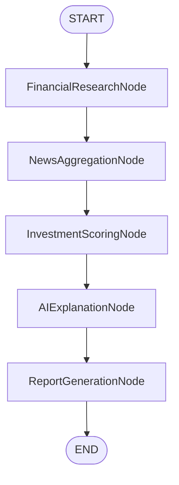

# System Architecture - InvestiMind AI

InvestiMind AI is designed with a strict clean architecture separating deterministic scoring logic (100% auditable TypeScript) from qualitative text analysis (100% LLM generated).

---

## 1. High Level Component Architecture

```
   ┌─────────────────────────────────────────────────────────┐
   │                       NEXT.JS UI                        │
   │           (Interactive React Dashboard Components)       │
   └────────────────────▲───────────────────┬────────────────┘
                        │                   │
               Response │                   │ POST Request
                Payload │                   │ { query: string }
                        │                   ▼
   ┌────────────────────┴────────────────────────────────────┐
   │                   NEXT.JS API ROUTE                     │
   │               (src/app/api/research/route.ts)           │
   └────────────────────▲───────────────────┬────────────────┘
                        │                   │
                        │ Invoke            │ State Graph
                        │                   ▼ Output
   ┌────────────────────┴────────────────────────────────────┐
   │                  LANGGRAPH STATE AGENT                  │
   │        (src/agents/investmentResearchGraph.ts)          │
   └────────────────────▲───────────────────┬────────────────┘
                        │                   │
                Get info│                   │ Invoke
                        │                   ▼
   ┌────────────────────┴────────────────────────────────────┐
   │                    EXTERNAL SERVICES                    │
   │   Yahoo Finance   │    News API Chain   │    Gemini     │
   │  (quoteSummary)   │  (GNews/NewsAPI/etc)│   2.5 Flash   │
   └─────────────────────────────────────────────────────────┘
```

---

## 2. LangGraph Execution Workflow

The research agent leverages `LangGraph.js` to structure data aggregation, calculation, and narrative generation into a state machine:



1. **FinancialResearchNode**: Resolves stock symbols, fetches income statements, balance sheets, and key stats from Yahoo Finance.
2. **NewsAggregationNode**: Gathers latest company headlines from sequentially chained news endpoints (GNews -> NewsAPI -> Alpha Vantage -> Finnhub).
3. **InvestmentScoringNode**: Compares metrics to sector benchmarks, runs scoring rules, and determines driver items.
4. **AIExplanationNode**: Packages headlines and metrics to generate theses and bull/bear outlines via a single Gemini 2.5 Flash call.
5. **ReportGenerationNode**: Bundles data, timestamps, generates the Audit Report ID, and validates the final response against Zod schemas.

---

## 3. Data Flow & Security Guardrails
- **AI Influence Guardrail**: The LLM has **0% influence** on mathematical calculations, scoring outputs, confidence indices, or final PASS/INVEST recommendations. This is physically enforced by calling Gemini only *after* scoring is finalized and prompting the model to only explain the calculated figures.
- **Strict Validation Layer**: Zod schemas validate API inputs, intermediate steps, and LLM JSON outputs. No unvalidated data reaches the UI.
- **Fail-degrade Isolation**: Individual API failures are isolated. The pipeline degrades the report quality parameters (penalizes confidence and reliability) rather than crashing.
